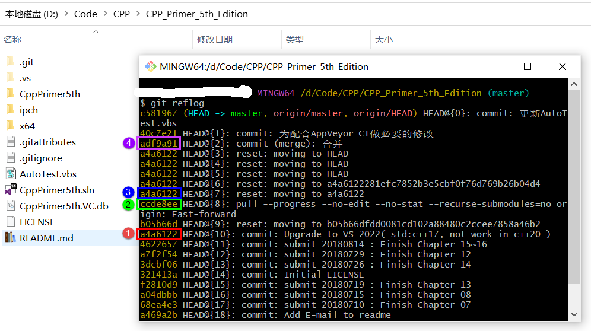

# Git Usage

## 🏃迁移本地仓库
本地已存在的仓库（例如之前从gitee克隆），完整地（包含所有提交记录）迁移到别的托管网站，以github为例：

    1. 在github上新建一个空仓库，README、gitignore和license都没必要初始化。得到此仓库的url：https://github.com/SharpSnake/xxx.git

    2. 设置本地仓库的远程地址，这里采用先删后加的覆盖策略：

        git remote rm origin
        
        git remote add origin https://github.com/SharpSnake/xxx.git
    
    3. 推送时遇到"Support for password authentication was removed"的错误，表示远程推送不再支持密码验证，改成token验证了，所以首先要在github上生成一个token：

        进入github的*Settings->Developer settings->Personal access tokens->Generate new token*，按页面提示生成即可。

        生成好的token（长度40左右，仅包含字母和数字）码一定要立刻记下来，这个页面仅显示一次。

    4. 推送本地仓库
    
        git push --mirror https://token@github.com/SharpSnake/xxx.git

        其中token替换成上一步生成好的码就可以了。
    
    5. 推送时遇到"OpenSSL SSL_read: Connection was reset, errno 10054"错误的解决办法：

        git config --global http.sslVerify "false"

## 🎭意外覆盖和回滚（重置）
这个问题来源于一次事故（对git高强度玩家来说当然不算什么，我平常都是借助GUI工具，很少直面git命令😭）：

- 提交并推送代码时，提示“**无法推送远程仓库，因为本地分支在远程分支的后面**”，原因是因为我2年前在别的机器上推送过1次，这次修改代码前忘记先同步到本地了。
- 本地同时出现了1个传入和1个传出，然后我拉取了一下，本地项目的代码就被覆盖，变成2年前的样子了。

本以为多天的心血要白费了，后来在网上查了下才知道自己犯了一个多么简单的错误。

原来本地的每一次提交都会被记录，只是当前分支的**HEAD**会指向你最后一次的提交或拉取，当然你也可以修改**HEAD**，用到了`reset`命令。于是这次“事故”是这样补救的：

1. 在本地仓库打开git命令窗口，使用`git reflog`查看所有历史记录，发现被覆盖掉的那次提交还在，代号是**a4a6122**；
2. 拉取到本地的那个2年前的提交代号是**ccde8ee**；
3. 使用回滚（重置）命令`git reset --hard a4a6122`，找回被覆盖掉的那个版本；
4. 然后再次提交并推送，按提示合并代码解决冲突，最终提交推送的是合并后的版本**adf9a91**；

