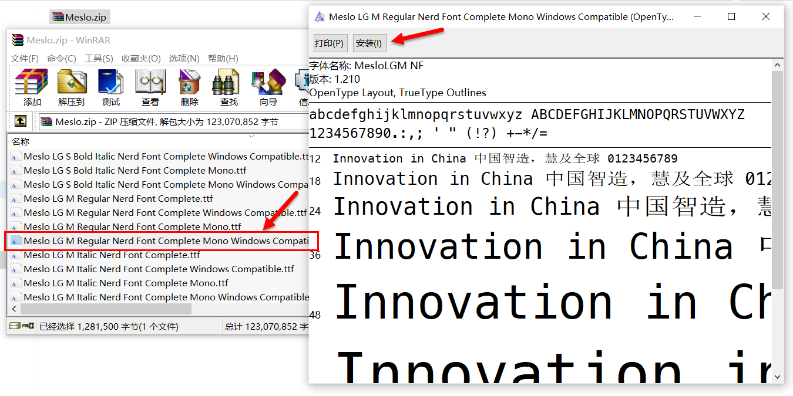
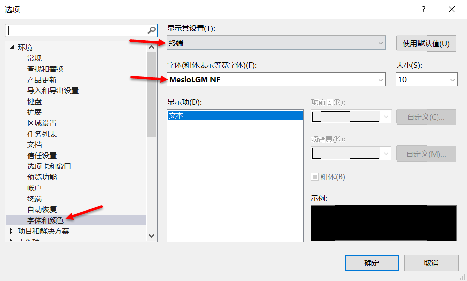
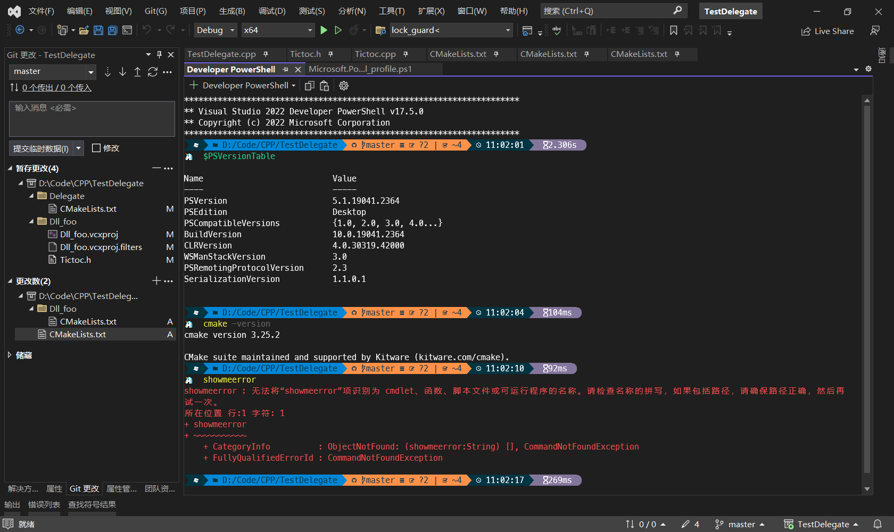

# Shell Usage

# 目录
- [🎨个性化PowerShell](#个性化powershell)
  - [一、安装Oh My Posh](#一安装oh-my-posh)
  - [二、配置PS](#二配置ps)
  - [三、效果展示](#三效果展示)
---

## 🎨个性化PowerShell
PowerShell（简称PS）是Windows下常用的命令行工具，它可以直接在**Visual Studio**内启动并作为一个标签页，用起来很方便。

但它没有**Windows Terminal**那么丰富的个性化设置，默认的配色不友好，多条命令之间不容易区分，若要个性化PS需要借助一个叫[Oh My Posh](https://ohmyposh.dev/)的第三方工具。

### 一、安装Oh My Posh
1. 参考[官方文档](https://ohmyposh.dev/docs/installation/windows)，建议直接在微软应用商店里安装，安装后会自动配置oh-my-posh.exe和内置主题目录的环境变量（Path和POSH_THEMES_PATH，默认在C:\Users\XXX\AppData\Local\Programs\oh-my-posh），后面会用到；

2. 安装[Nerd Fonts](https://ohmyposh.dev/docs/installation/fonts)，Oh My Posh里的文字和符号都借助了这个开源字体库，必须正确安装后命令行才能显示正常，这里下载了官方推荐的[Meslo LGM NF](https://github.com/ryanoasis/nerd-fonts/releases/download/v2.1.0/Meslo.zip)字体包，选择其中一个然后如下图所示手动安装：

**Windows Terminal**的字体配置参考[官方文档](https://ohmyposh.dev/docs/installation/fonts#windows-terminal)，**Visual Studio**内嵌终端的字体设置如下图所示：



### 二、配置PS
参考[官方文档](https://ohmyposh.dev/docs/installation/prompt)即可，这里仅记录配置过程可能遇到的几个问题。

1. 设置PS的执行策略     
为了允许PS正确的运行脚本，需要首先使用管理员权限执行两个命令，否则启动时会报错：
``` shell
   Set-ExecutionPolicy RemoteSigned
   Set-ExecutionPolicy Unrestricted
```

2. 使用Oh My Posh内置主题       
内置主题目录的环境变量前面已经设置好了，PS配置脚本文件（默认保存在C:\Users\XXX\Documents\WindowsPowerShell下）可以这样写：
``` shell
oh-my-posh init pwsh --config "$env:POSH_THEMES_PATH\unicorn.omp.json" | Invoke-Expression
```

3. VS内启动PS时报错：*无法将“Oh My Posh”项识别为 cmdlet、函数、脚本文件或可运行程序的名称*        
如果安装过程VS处于打开状态，环境变量没有立即生效，重启VS即可。


### 三、效果展示
一些主题不仅可以显示时间日期，还可以显示每行命令的执行用时、git仓库的改动情况等等。


My favorite [themes](https://ohmyposh.dev/docs/themes):
- unicorn
- atomic
- montys
- quick-term
