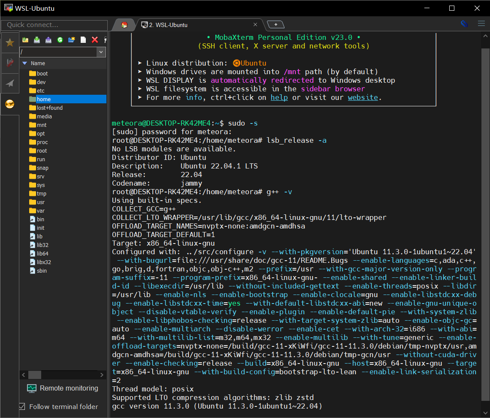
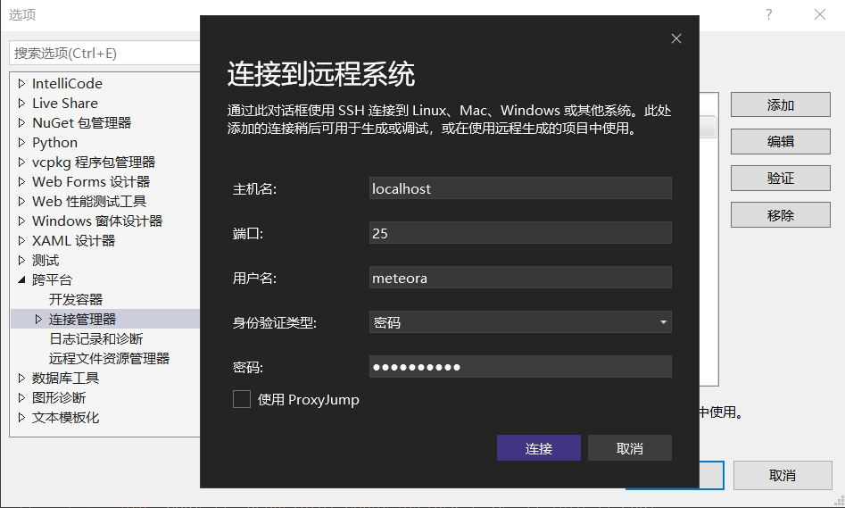
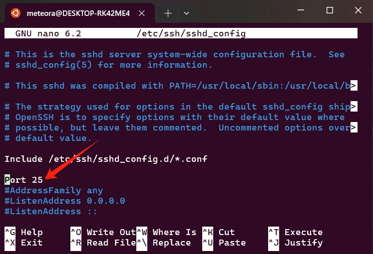
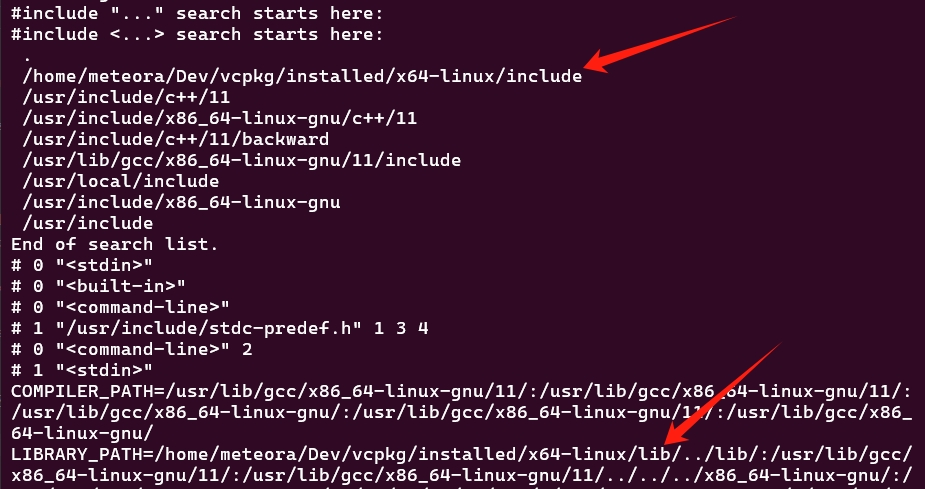

# Windows Subsystem for Linux(WSL)

- [Install WSL](#install-wsl)
- [Enjoy WSL✌️](#enjoy-wsl️)
- [Connect to Visual Studio](#connect-to-visual-studio)
- [Development Tricks](#development-tricks)


## Install WSL

安装步骤按照官方指引[使用 WSL 在 Windows 上安装 Linux](https://learn.microsoft.com/zh-cn/windows/wsl/install)即可。旧版Windows（所谓旧版我猜测是相对Win11的Win10，或Win10较旧的版本号）应参照[旧版 WSL 的手动安装步骤](https://learn.microsoft.com/zh-cn/windows/wsl/install-manual)。我的系统是Win10 19044版本，实际上基本是参考旧版安装指引来的。

这里仅列出安装过程中可能遇到的几个问题，以及解决方法。

- **启用Windows功能**   
    **控制面板->程序和功能->启用或关闭Windows功能**中有两项是必须启用的：
    - 适用于Linux的Windows子系统
    - 虚拟机平台

    勾选并点击确定后，可能会提示更新失败，导致后续无法[更新WSL2](https://learn.microsoft.com/zh-cn/windows/wsl/install-manual#step-4---download-the-linux-kernel-update-package)，这时可以先取消勾选点击确定，然后再次勾选点击确定。期间保险起见，要重启电脑。

- **启用Hyper-V**   
    同样在**控制面板->程序和功能->启用或关闭Windows功能**中要启用这一项，但奇怪的是我的功能列表中没有这一项（可能是以前不知道怎么卸载掉了），这时候需要手动安装Hyper-V，从网上摘抄了一段安装命令，保存为一个cmd文件后以管理员身份运行即可：
    ``` cmd
    pushd "%~dp0"
    dir /b %SystemRoot%\servicing\Packages\*Hyper-V*.mum >hyper-v.txt
    for /f %%i in ('findstr /i . hyper-v.txt 2^>nul') do dism /online /norestart /add-package:"%SystemRoot%\servicing\Packages\%%i"
    del hyper-v.txt
    Dism /online /enable-feature /featurename:Microsoft-Hyper-V-All /LimitAccess /ALL
    ```
    安装过程需要几分钟并重启电脑，之后功能列表中就会出现Hyper-V。

- **应用商店无法下载Linux**     
    错误代码：0x80072EFD，具体原因未知，这种情况只能手动下载安装包，官方提供的[Linux 发行版安装包](https://learn.microsoft.com/zh-cn/windows/wsl/install-manual#downloading-distributions)：
    - Ubuntu 22.04 LTS
    - Debian GNU/Linux
    - Kali Linux
    - Oracle Linux 8.5
    - ...
    
    下载后文件后缀可能是".zip"，手动改为".appx"然后运行即可。由于系统或机器原因，可能无法安装ARM版本，可以尝试安装x64版本的发行版。

- **启动Linux失败**     
    从开始菜单启动安装好的发行版，要等好久（正常的话立刻会弹出一个命令行窗口），最终返回错误代码：0x80072ee7，在PowerShell中输入`wsl -l -v`也查不到版本信息。  

    猜测是网络设置原因，这里提供一个不保证100%正确的（因为后面我把这个设置还原后也能成功启动Linux）解决方案：
    1. 打开**控制面板->网络和共享中心->更改适配器设置**
    2. 双击点开当前的**网络连接**（以太网或WLAN），点击**属性**
    3. 打开“**Internet协议版本4(TCP/IPv4)**”这一项
    4. 选择“**使用以下DNS服务器**”进行手动设置，
        - 在首选DNS服务器中输入：4.2.2.1
        - 在备用DNS服务器中输入：4.2.2.2

## Enjoy WSL✌️
一切就绪后，再次使用命令`wsl -l -v`查看已安装的Linux发行版：
``` cmd
PS C:\Users> wsl -l -v
  NAME      STATE           VERSION
* Ubuntu    Running         2
```
就可以正常使用了，可能还需要安装一些库和编译环境，以VC++跨平台开发为例，可以参考[设置适用于跨平台 C++ 开发的 Linux 计算机](https://learn.microsoft.com/zh-cn/cpp/build/get-started-linux-cmake?view=msvc-170#prerequisites)。

从开始菜单点击发行版图标或安装一个[Windows终端](https://apps.microsoft.com/store/detail/windows-terminal/9N0DX20HK701?hl=zh-cn&gl=cn&rtc=1)都可以打开Linux。这里推荐使用[MobaXterm](https://mobaxterm.mobatek.net/)这个软件和Linux进行交互。



## Connect to Visual Studio

官方文档：[在 Visual Studio 中连接到你的目标 Linux 系统](https://learn.microsoft.com/zh-cn/cpp/linux/connect-to-your-remote-linux-computer?view=msvc-170) ，这一过程可能会遇到一些问题：

- **启动SSH服务器**  
  在VS连接管理器中主机名、端口、用户名和密码都填好了，linux终端也启动了，但还是连接失败。是因为WSL下linux不会自动启动ssh服务（`sudo systemctl enable ssh`不起作用），需要每次启动linux时手动启动：
  ``` shell
  sudo apt install openssh-server（如果已安装，无需运行此行）
  sudo service ssh start
  ```

- **设置端口**  
  
  主机名默认是localhost，端口默认是22，用户名和密码是linux初次使用时设置好的。修改端口的方法：
  ``` shell
  sudo nano /etc/ssh/sshd_config
  ```
  
  添加如上配置，按下Ctrl + X，按Y键确认保存，再按Enter键退出。
  最后运行：
  ``` shell
  sudo service ssh restart
  ```
  新的端口生效。

## Development Tricks

- **访问Github**  
  在linux中访问Github会遇到：Failed to connect to xxx.com port 443，解决方法是使用[GitHub520](https://github.com/521xueweihan/GitHub520)这个库（备用链接：[Gitee镜像](https://gitee.com/meteora/GitHub520)），通过修改hosts重定向github网址（Windows下推荐使用Watt Toolkit）。  
  运行`sudo nano /etc/hosts`在末尾添加最新的hosts列表并保存，重启系统。

- **使用CMake**  
  使用CMake如果遇到：Could not find OpenSSL.  Install an OpenSSL development package or configure CMake with -DCMAKE_USE_OPENSSL=OFF to build without OpenSSL.  
  有两种解决方法：  
  - 安装OpenSSL：`sudo apt-get install libssl-dev`
  - 在项目顶层CMakeLists.txt文件的开头加入`set(CMAKE_USE_OPENSSL OFF)`

- **配置vcpkg**  
  vcpkg安装后把头文件、库目录加到gcc的搜索路径中，类似于Windows的环境变量。  
  运行：`sudo nano ~/.bashrc`（也有说其他文件的，经过测试只有这个有效），在文件末尾添加：
  ``` shell
  export VCPKG_ROOT=/path/to/vcpkg
  export LIBRARY_PATH=$LIBRARY_PATH:$VCPKG_ROOT/installed/x64-linux/lib
  export LD_LIBRARY_PATH=$LD_LIBRARY_PATH:$VCPKG_ROOT/installed/x64-linux/lib
  export C_INCLUDE_PATH=$C_INCLUDE_PATH:$VCPKG_ROOT/installed/x64-linux/include
  export CPLUS_INCLUDE_PATH=$CPLUS_INCLUDE_PATH:$VCPKG_ROOT/installed/x64-linux/include
  ```
  运行`source ~/.bashrc`或重启终端后将永久生效（如果仅在终端中运行上述命令，下次启动新的终端会失效）。  
  查看gcc的状态：`echo | g++ -v -x c++ -E -`
  

