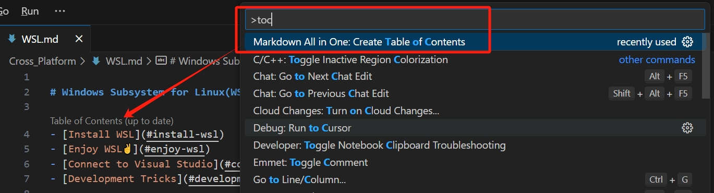
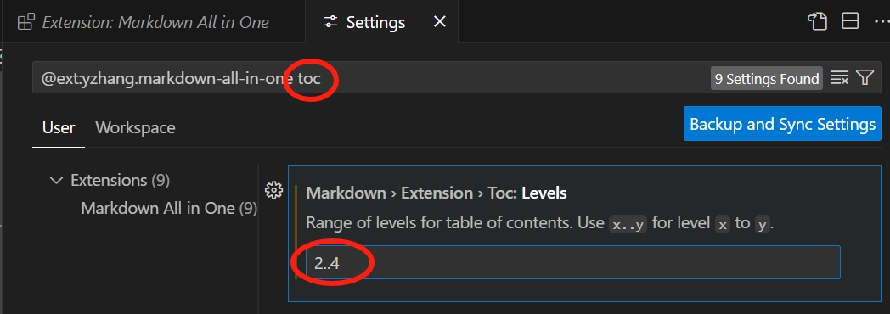
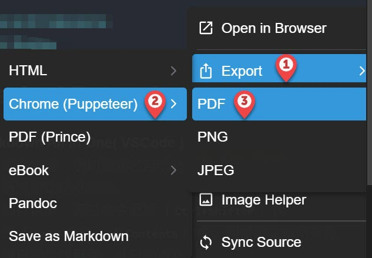

# Markdown Tips

- [Tools And Extensions](#tools-and-extensions)
- [Basic Syntax](#basic-syntax)

## Tools And Extensions

- **Markdown All in One( VSCode )**
  - 辅助编辑：例如资源名自动补全、字体加粗快捷键、链接自动粘贴等等
  - 制作目录：通过命令面板（`Ctrl+Shift+P`）执行`Create Table of Contents`命令，则根据文章所有标题自动生成目录，并自动更新
  
  可以更改用于生成目录的标题级别：
  

- **Markdown Preview Enhanced( VSCode )**
  - 比VSCode自带预览器更准确地渲染（例如表格边框），可以设置文章以及代码片段的主题风格（右键菜单或右下角菜单按钮），提供更佳的阅读体验
  - 导出PDF：
    1. 快速导出：
    
    2. 自定义：如需修改页面布局或纸张，可以选择`Open in Browser`，然后再使用浏览器的打印功能导出为PDF

- **[StackEdit](https://stackedit.io/app#)**
  一款在线Markdown编辑器，优点是有toolbar，需要注意的是，粘贴文本时，一定要在浏览器右键菜单中选择`粘贴为纯文本`，否则已有格式可能出错

## Basic Syntax