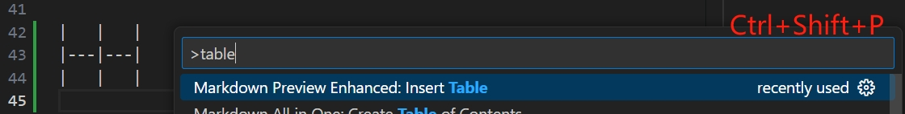
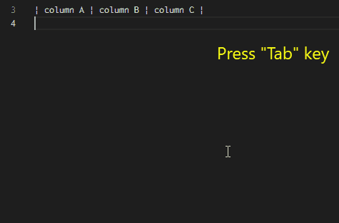
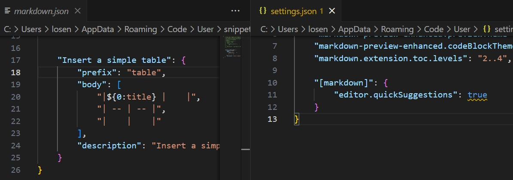

# Markdown Tips

- [Tools And Extensions](#tools-and-extensions)
  - [Visual Studio Code](#visual-studio-code)
  - [Markdown All in One( VSCode )](#markdown-all-in-one-vscode-)
  - [Markdown Preview Enhanced( VSCode )](#markdown-preview-enhanced-vscode-)
  - [Markdown Table( VSCode )](#markdown-table-vscode-)
  - [StackEdit](#stackedit)
- [Advanced Syntax](#advanced-syntax)
  - [任务列表](#任务列表)
  - [高亮](#高亮)
  - [对齐](#对齐)
  - [脚注](#脚注)
  - [图表（Mermaid）](#图表mermaid)
  - [数学公式](#数学公式)


## Tools And Extensions

### Visual Studio Code
- **路径补全：转到标题**
  1. 链接路径开头输入一个`#`，列出当前文档的相应标题  
  
  2. 链接路径开头输入两个`#`，列出当前工作区所有文档的相应标题  
  
- **标题引用、重命名**：按`Shift + Alt + F12`查看所有引用当前标题的位置；按`F2`重命名标题，并更新所有引用此标题的地方

更多内容详见：[Markdown and Visual Studio Code](https://code.visualstudio.com/docs/languages/markdown)


### Markdown All in One( VSCode )
- **辅助编辑**：资源名[自动补全](https://marketplace.visualstudio.com/items?itemName=yzhang.markdown-all-in-one#auto-completions)、字体加粗[快捷键](https://marketplace.visualstudio.com/items?itemName=yzhang.markdown-all-in-one#keyboard-shortcuts-1)、链接自动粘贴等等
- **制作目录**：通过命令面板（`Ctrl+Shift+P`）执行`Create Table of Contents`命令，则根据文章所有标题自动生成目录，并自动更新：  

可以更改用于生成目录的标题级别：  


### Markdown Preview Enhanced( VSCode )
比VSCode自带预览器更准确地渲染（例如表格边框），可以设置文章以及代码片段的主题风格（右键菜单或右下角菜单按钮），提供更佳的阅读体验
- **导出PDF**：
  1. 快速导出：  
  
  2. 自定义：如需修改页面布局或纸张，可以选择`Open in Browser`，然后再使用浏览器的打印功能导出为PDF
- **插入表格**：在命令面板执行`Insert Table`，可以在指定位置插入一个空白表格  


### Markdown Table( VSCode )  
辅助编辑表格，有以下功能：
- **插入列**：右键菜单`Markdown Table:Insert column in the right/left`
- **移动列**：右键菜单`Markdown Table:Move to Right/left`
- **Tab键**：快速定位到下一个单元格，如果在行末则插入新的一行  
  
- **对齐方式**：右键菜单`Markdown Table:Align to Left/Center/Right`
- **拷贝表格**：
  1. 先将Excel或CSV表格以文本形式粘贴
  2. 选中粘贴好的文本右键菜单`Markdown Table:Convert TSV/CSV to table`
- **格式化**：右键菜单`Markdown Table:Format all tables`，对齐表格文本，但对最终显示没有影响
- **插入表格**：需要自定义[代码片段](https://marketplace.visualstudio.com/items?itemName=TakumiI.markdowntable#add-a-snippet-to-create-a-simple-table)，并启用Markdown的[自动补全](https://marketplace.visualstudio.com/items?itemName=TakumiI.markdowntable#enable-snippets-suggestion)功能，不建议使用  


### [StackEdit](https://stackedit.io/app#)  
一款在线Markdown编辑器，优点是有toolbar，需要注意的是，粘贴文本时，一定要在浏览器右键菜单中选择`粘贴为纯文本`，否则已有格式可能出错


## Advanced Syntax

### 任务列表
- [x] Task already done
- [ ] Task to do

```
- [x] Task already done
- [ ] Task to do
```
💡：使用快捷键`Alt + C`切换状态

### 高亮
Highlight these <mark>important words</mark>

```
Highlight these ==important words==
Highlight these <mark>important words</mark>
```
💡：某些渲染器可能不支持第1种语法，但通常都支持HTML

### 对齐
<p align="left">左对齐</p>
<p align="center">居中</p>
<p align="right">右对齐</p>

```html
<p align="left">左对齐</p>
<p align="center">居中</p>
<p align="right">右对齐</p>
```

### 脚注


### 图表（Mermaid）


### 数学公式